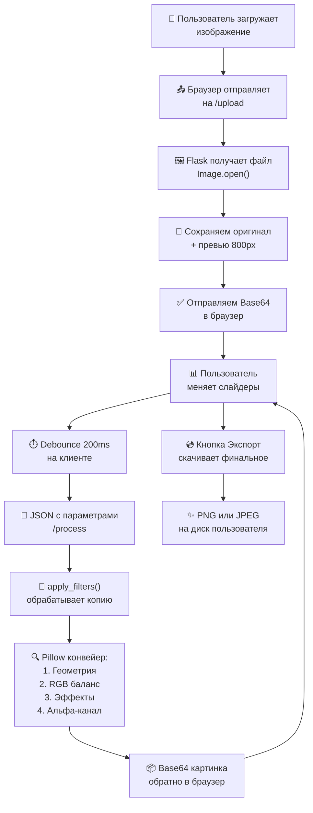

# 🎨 PyWeb Editor

> **Мощь Python и удобство Веба** - локальный графический редактор изображений с приватностью и скоростью

---

## 👥 Авторы

- **🔧 Иванов Ф.В.** 
- **💻 Стажков Д.А.** 

---

## 📊 Технический стек


---

## 🎯 Актуальность проблемы

### 📍 Почему существующие решения неудовлетворительны?

| **Проблема**        | **Существующие решения**                                                      | **Наше решение**                                       |
| ------------------- | ----------------------------------------------------------------------------- | ------------------------------------------------------ |
| **Скорость работы** | Десктопные редакторы (Photoshop, GIMP) требуют установки и занимают гигабайты | 🚀 Работает в браузере, нет установки                  |
| **Приватность**     | Онлайн-сервисы загружают данные на внешние серверы                            | 🔒 **100% локально**, ваши фото остаются на компьютере |
| **Удобство**        | Веб-редакторы часто урезаны в функциях                                        | ⚡ Полнофункциональный, но лёгкий интерфейс             |
| **Доступность**     | Дорогие подписки или лимиты                                                   | 💰 **Бесплатно и открыто**                             |

### ✨ Наше решение

**PyWeb Editor** - это **локальный сервер на Flask**, который обрабатывает изображения через **Pillow**, а интерфейс построен на **Vanilla JavaScript + Tailwind**. Никакие данные не отправляются в облако - всё работает на вашем компьютере.

---

## 🎬 Демонстрация возможностей

### Интерфейс приложения
[](https://postimg.cc/r0sPWzL3)

### 🌟 Поддерживаемые функции

#### 📐 **Геометрия**
- ➡️ Поворот на 90° / -90°
- ↔️ Отражение по осям (горизонтально / вертикально)
[](https://postimg.cc/H87b11Qc)
#### 🎚️ **Коррекция**
- ☀️ Яркость (0 - 2.0)
- 🔲 Контраст (0 - 2.0)
- 🌈 Насыщенность (0 - 3.0)
- 🔪 Резкость (0 - 5.0)
[](https://postimg.cc/G84yvngS)

#### 🎨 **RGB-баланс**
- 🔴 Красный (0 - 2.0)
- 🟢 Зелёный (0 - 2.0)
- 🔵 Синий (0 - 2.0)
[](https://postimg.cc/Hj5Jm2q5)
#### ✨ **Специальные эффекты**
- 🌑 **Виньетка** (градиент затемнения по краям)
- 🌫️ **Размытие** (от 0 до 10 пикселей)
- **Чёрно-белый** (конвертация в grayscale)
- **Сепия** (ретро-эффект)
- **Негатив** (инверсия цветов)
[](https://postimg.cc/hJfj5bLN)
#### 💾 **История редактирования**
- ↩️ **Undo** (отмена)
- ↪️ **Redo** (повтор)
- **До 15 состояний** в памяти
[](https://postimg.cc/sGcsXv9C)

---

## 🏗️ Архитектура системы

### Стек технологий

```
┌─────────────────────────────────────────────────────┐
│  FRONTEND                                           │
│  • Vanilla JavaScript (ES6+)                        │
│  • Tailwind CSS (дизайн)                            │
│  • Font Awesome (иконки)                            │
└────────────────────┬────────────────────────────────┘
                     │ JSON (HTTP POST)
                     ▼
┌─────────────────────────────────────────────────────┐
│  BACKEND                                            │
│  • Flask (REST API)                                 │
│  • Python 3.8+                                      │
│  • ImageStore (сессионная память)                   │
└────────────────────┬────────────────────────────────┘
                     │
                     ▼
┌─────────────────────────────────────────────────────┐
│  ОБРАБОТКА ИЗОБРАЖЕНИЙ                              │
│  • Pillow (PIL)                                     │
│  • ImageEnhance (фильтры)                           │
│  • ImageDraw, ImageFilter (эффекты)                 │
└─────────────────────────────────────────────────────┘
```

### Поток данных (Mermaid диаграмма)



### Ключевой момент: **Неразрушающее редактирование**

#### Как работают простые редакторы (Разрушающий подход):
- Каждый новый фильтр накладывается поверх предыдущего результата.
- *Пример*: Увеличили яркость → картинка "выцвела". Затем увеличили контраст → "выцветшие" пиксели стали жестче.
- **Итог**: Быстрая потеря деталей, появление цифрового шума, невозможность качественно отменить действие.

#### Как работает PyWeb Editor  (Неразрушающий подход):
- Мы храним исходное изображение в оперативной памяти и никогда его не меняем.
- При любом изменении ползунка (например, контраста):
	- Берется свежая копия чистого оригинала (original_image.copy()).
	- К ней применяются сразу все актуальные настройки  
	  (яркость + контраст + фильтры).
- **Итог**: Максимальное качество изображения на любом этапе работы. Изменение одного параметра не портит другие.
---

## 🔧 Ключевые технические решения

### 1️⃣ **Undo/Redo: Параметрическая история**

Вместо сохранения копии изображения после каждого изменения, мы сохраняем **параметры редактирования**. Это экономит память в 100+ раз!

**Как это работает:**

```javascript
// История хранит ПАРАМЕТРЫ, а не картинки
let history = [
    { brightness: 1.0, contrast: 1.0, rotation: 0, ... },
    { brightness: 1.2, contrast: 1.0, rotation: 0, ... },  // После изменения яркости
    { brightness: 1.2, contrast: 1.3, rotation: 0, ... }   // После изменения контраста
];

// При отмене просто берём параметры из истории и отправляем на сервер
function historyUndo() {
    historyIndex--;
    const state = history[historyIndex];  // Оттуда берём параметры
    applyStateToUI(state);                 // Обновляем UI
    sendUpdate(state);                     // Отправляем на сервер для обработки
}
```

**Преимущества:**
- ✅ Максимум 15 состояний = ~1-2 KB памяти (вместо 15 копий по 5-100 MB)
- ✅ Мгновенная отмена/повтор
- ✅ Легко синхронизировать между браузером и сервером

---

### 2️⃣ **Неразрушающее редактирование (Non-Destructive Editing)**

**Проблема:** Если мы обрабатываем уже обработанное изображение (сжатое до JPEG), теряется качество при каждом фильтре.

**Решение:** Храним **оригинал** и **превью** отдельно:

```python
# backend: app.py
class ImageStore:
    def __init__(self):
        self.original_image = None    # ← Никогда не меняется
        self.preview_image = None     # ← Копия для работы

@app.route('/process', methods=['POST'])
def process():
    if not store.preview_image:
        return jsonify({'status':'error'})
    
    # КЛЮЧЕВОЙ МОМЕНТ: берём СВЕЖУЮ копию превью, а не результат последней обработки
    res_img = apply_filters(store.preview_image.copy(), request.json)
    #                       ↑ .copy() это критично
    return jsonify({
        'status':'success', 
        'image': image_to_base64(res_img)
    })
```

**Почему это важно:**
- Каждый фильтр применяется к чистому изображению
- Нет накопления артефактов сжатия
- Качество экспорта максимально

---

### 3️⃣ **Оптимизация: Debounce на клиенте + Preview на сервере**

**Проблема:** Отправлять запрос на сервер при каждом движении слайдера = перегруз!

**Решение:** Двухуровневая оптимизация:

```javascript
// УРОВЕНЬ 1: Debounce на КЛИЕНТЕ
const debouncedSend = debounce(() => sendUpdate(), 200);
//                     ↑ Ждём 200ms после последнего движения, потом шлём

function liveUpdate(id) {
    const val = document.getElementById(id).value;
    // Обновляем UI СРАЗУ (плавность)
    document.getElementById('val-' + id).innerText = val;
    // Отправляем на сервер через debounce
    debouncedSend();
}

// УРОВЕНЬ 2: Preview на СЕРВЕРЕ
def resize_for_preview(img, max_width=800):
    """Создание легкой копии для быстрого предпросмотра."""
    ratio = min(max_width/img.width, 1.0)
    if ratio >= 1: return img.copy()
    return img.resize(  # ← Обрабатываем меньшее изображение
        (int(img.width*ratio), int(img.height*ratio)), 
        Image.Resampling.LANCZOS
    )
```

**Результат:**
- ⚡ UI отзывчивый 
- 🚀 Сервер не перегружен (max 5 запросов/сек вместо 50+)
- 📈 Фильтры применяются очень быстро (на 800px изображении)

---

### 4️⃣ **PNG и прозрачность: Сохранение Alpha-канала**

**Проблема:** PNG с прозрачностью (RGBA) не может быть сохранён как JPEG (нет альфа-канала).

**Решение:** Анализируем режим и выбираем правильный формат:

```python
# backend: processors.py
def image_to_base64(img):
    """Конвертация PIL Image в base64 строку."""
    buf = io.BytesIO()
    
    # КЛЮЧЕВОЙ МОМЕНТ: проверяем режим изображения
    if img.mode == 'RGBA':
        # Если есть прозрачность → PNG
        img.save(buf, format="PNG")
    else:
        # Иначе → JPEG (меньше размер)
        img.save(buf, format="JPEG", quality=85)
    
    return base64.b64encode(buf.getvalue()).decode('utf-8')

def apply_filters(img, params):
    """Конвейер обработки с сохранением альфа-канала."""
    
    # ... обработка фильтров ...
    
    # ПЕРЕД ФИНАЛИЗАЦИЕЙ: восстанавливаем альфа-канал
    alpha = None
    if img.mode == 'RGBA':
        alpha = img.getchannel('A')  # ← Сохраняем альфа-канал
        img = img.convert('RGB')     # ← Обрабатываем как RGB
    
    # ... применяем фильтры (яркость, контраст и т.д.) ...
    
    # В конце: возвращаем альфа-канал
    if alpha:
        if alpha.size != img.size:
            alpha = alpha.resize(img.size)
        img.putalpha(alpha)  # ← Прозрачность восстановлена
    
    return img
```

**Почему это сложно:**
- Многие фильтры Pillow работают только с RGB, не RGBA
- Размер изображения может измениться (поворот с `expand=True`)
- Альфа-канал нужно восстанавливать в конце цепочки

**Наше решение:**
- ✅ Извлекаем альфа в начале
- ✅ Обрабатываем изображение как RGB
- ✅ Восстанавливаем альфа в конце

---

### 5️⃣ **Специальный эффект: Виньетка с маской**

```python
def apply_vignette(img, intensity):
    """Создает виньетку с учетом прозрачности."""
    if intensity <= 0: return img
    
    # Шаг 1: Создаём чёрный слой
    black_layer = Image.new('RGB', img.size, (0,0,0))
    
    # Шаг 2: Создаём маску-овал (плавное затемнение по краям)
    mask = Image.new('L', img.size, 0)
    draw = ImageDraw.Draw(mask)
    
    # Рассчитываем радиусы овала в зависимости от intensity
    x_radius = (img.width // 2) * (0.75 - 0.4 * intensity)
    y_radius = (img.height // 2) * (0.75 - 0.4 * intensity)
    
    # Рисуем белый овал (это будет "светлая" часть)
    draw.ellipse([...], fill=255)
    
    # Шаг 3: Размываем маску для плавного градиента
    mask = mask.filter(ImageFilter.GaussianBlur(radius=20))
    
    # Шаг 4: Комбинируем изображение и чёрный слой через маску
    return Image.composite(img, black_layer, mask)
    #      ↑ Где маска = 255, видно исходное изображение
    #      где маска = 0, видно чёрный слой
```

---

## 📦 Структура проекта

```
PyWeb-Editor/
├── app.py                    # Flask приложение (точка входа)
├── processors.py             # Все фильтры и обработка изображений
├── templates/
│   └── index.html           # Главная страница (Jinja2 + Tailwind)
├── static/
│   ├── script.js            # Логика UI, История, Debounce
│   └── style.css            # Дополнительные стили
└── README.md                
```

---

## 🚀 Быстрый старт

### ✅ Требования
- **Python 3.8+**
- **pip** (менеджер пакетов)

### 📥 Установка

```bash
# 1. Клонируем репозиторий
git clone https://github.com/DEIL111428/pyweb-editor.git
cd pyweb-editor

# 2. Создаём виртуальное окружение (рекомендуется)
python -m venv venv

# На Windows:
venv\Scripts\activate
# На macOS/Linux:
source venv/bin/activate

# 3. Устанавливаем зависимости
pip install -r requirements.txt
# (или вручную: pip install flask pillow)

# 4. Запускаем сервер
python app.py
```

### 🌐 Открываем приложение

Откройте в браузере:
```
http://127.0.0.1:5000
```

Готово! 🎉

---

## 📋 Как использовать

1. **Загружаем изображение** - кликаем на кнопку "Открыть" (левый верхний угол)
2. **Меняем слайдеры** - перемещаем слайдеры для фильтров (живой предпросмотр!)
3. **История** - используем "Отмена" / "Повтор" для отката
4. **Сброс** - кнопка внизу панели для сброса всех параметров
5. **Экспортируем** - кликаем "Экспорт" для скачивания на компьютер

---

## 🛣️ Roadmap (планы на будущее)

### 🔄 Версия 1.1
- [ ] **Crop Tool** - обрезка изображения (добавить координаты x, y, width, height в params)
- [ ] **Rotate Slider** - плавный поворот (не только 90° шаги)
- [ ] **Flip Preview** - превью отражения до применения

### 🎓 Версия 1.2
- [ ] **AI Фон-Ремувер** - удаление фона с помощью `rembg` или `ONNX`
- [ ] **Batch Processing** - обработка нескольких файлов сразу
- [ ] **Presets** - сохранённые наборы фильтров ("Инстаграм", "Винтаж" и т.д.)

### 🌟 Версия 2.0
- [ ] **Mask Tool** - рисование на маске для локальной обработки
- [ ] **Layers** - поддержка слоёв (как в Photoshop)
- [ ] **Export Options** - выбор качества, формата, размера при экспорте
- [ ] **Dark Mode Toggle** - переключение темы (уже почти чёрная)

---


